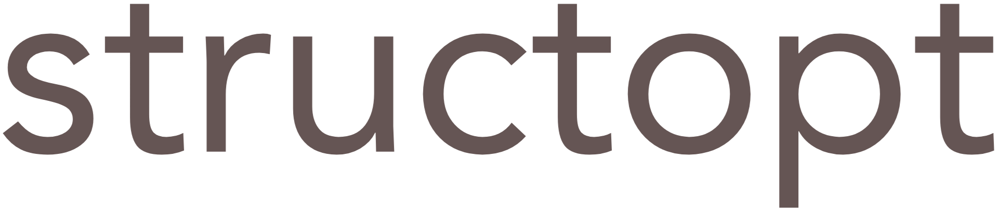

<p align="center">
    
</p>

<p align="center">
  Parse command line arguments by defining a struct
</p>

<p align="center">
  <a href="https://en.wikipedia.org/wiki/C%2B%2B17">
    
  </a>
  <a href="https://github.com/p-ranav/tabulate/blob/master/LICENSE">
    
  </a>
  
</p>

## Quick Start

```cpp
struct Options {
   // positional argument
   //   e.g., ./main <file>
   std::string config_file;

   // optional argument
   //   e.g., -b "192.168.5.3"
   //   e.g., --bind_address "192.168.5.3"
   // The long option can be passed in kebab case
   //   e.g., --bind-address "192.168.5.3"
   std::optional<std::string> bind_address;
 
   // You want a flag?
   // Use `std::optional<bool>` and provide a default value. 
   //   e.g., -v
   //   e.g., --verbose
   std::optional<bool> verbose = false;

   // Directly define and use enum classes
   // The argument (string) will be converted (if possible)
   // into the equivalent enum value
   //   e.g., --log-level debug
   //   e.g., -l error
   enum class LogLevel { debug, info, warn, error, critical };
   std::optional<LogLevel> log_level = LogLevel::info;

   // Here, structopt will check for `-u` or `--user` 
   // and parse the next 2 arguments into an `std::pair`
   std::optional<std::pair<std::string, std::string>> user;

   // You can use containers like std::vector
   // when you don't know the total number of arguments
   // but want to collect them all into a list
   std::vector<std::string> files;
};
STRUCTOPT(Options, config_file, bind_address, verbose, log_level, user, files);
```

Create a `structopt::app` and parse the command ling arguments into the `Options` struct:

```cpp
int main(int argc, char *argv[]) {
  
  // Line of code that does all the work:
  auto options = structopt::app("my_app").parse<Options>(argc, argv);

  // Print out parsed arguments:

  // std::cout << "config_file  = " << options.config_file << "\n";
  // std::cout << "bind_address = " << options.bind_address.value_or("not provided") << "\n";
  // std::cout << "verbose      = " << std::boolalpha << options.verbose.value() << "\n";
  // ...
}
```

Now let's pass some arguments to this program:

```bash
▶ ./my_app config.csv file5.csv file6.json
config_file  = config.csv
bind_address = not provided
verbose      = false
log_level    = 1
user         = not provided
files        = { file5.csv file6.json }

▶ ./my_app config.csv --bind-address localhost:9000 -v -log-level error file1.txt file2.txt
config_file  = config.csv
bind_address = localhost:9000
verbose      = true
log_level    = 3
user         = not provided
files        = { file1.txt file2.txt }

▶ ./my_app config_2.csv --bind-address 192.168.7.3 -log-level debug file1.txt file3.txt file4.txt --user "Pranav Kumar" "pranav.kumar@foo.com"
config_file  = config_2.csv
bind_address = 192.168.7.3
verbose      = false
log_level    = 0
user         = Pranav Kumar<pranav.kumar@foo.com>
files        = { file1.txt file3.txt file4.txt }
```

## Table of Contents

*    [Getting Started](#getting-started)
     *    [Positional Arguments](#positional-arguments)
     *    [Optional Arguments](#optional-arguments)
     *    [Flag Arguments](#flag-arguments)
     *    [Enum Classes](#enum-classes)
     *    [Gathering Remaining Arguments](#gathering-remaining-arguments)
*    [Building Samples](#building-samples)
*    [Generating Single Header](#generating-single-header)
*    [Contributing](#contributing)
*    [License](#license)

## Getting Started 

Include `<structopt/app.hpp>` and you're good to go.

`structopt` supports a variety of argument types including positional, optional, flags, and compound arguments. Below you can see how to configure each of these types:

### Positional Arguments

Here's an example of some positional arguments:

```cpp
struct FileOptions {
  // Positional arguments
  // ./main <input_file> <output_file>
  std::string input_file;
  std::string output_file;
};
STRUCTOPT(FileOptions, input_file, output_file);


int main(int argc, char *argv[]) {
  auto options = structopt::app("my_app").parse<FileOptions>(argc, argv);

  std::cout << "\nInput file  : " << options.input_file << "\n";
  std::cout << "Output file : " << options.output_file << "\n";
}
```

```bash
▶ ./main foo.txt bar.csv

Input file  : foo.txt
Output file : bar.csv
```

### Optional Arguments

Now, let's look at optional arguments. To configure an optional argument, use `std::optional` in the options struct:

```cpp
struct Options {
  // Optional argument
  // -f, --fixed_point, --fixed-point <fixed_point...>
  std::optional<std::array<float, 3>> fixed_point;
};
STRUCTOPT(Options, fixed_point);


int main(int argc, char *argv[]) {
  auto options = structopt::app("my_app").parse<Options>(argc, argv);

  if (options.fixed_point.has_value()) {
    std::cout << "Point: {" << options.fixed_point.value()[0] << ", " 
                            << options.fixed_point.value()[1] << ", "
                            << options.fixed_point.value()[2] << "}\n";
  }
}
```

```bash
▶ ./main

▶ ./main --fixed_point 1.1 -2.2 3.3
Point: {1.1, -2.2, 3.3}

▶ ./main -f 1 2 3
Point: {1, 2, 3}
```

#### Combining Positional and Optional Arguments

```cpp
struct Option {
  // positional argument
  // input number
  int input{0};

  // flag argument
  // enable verbosity
  std::optional<bool> verbose = false;
};
STRUCTOPT(Option, input, verbose);


int main(int argc, char *argv[]) {
  auto options = structopt::app("my_app").parse<Option>(argc, argv);

  if (options.verbose == true) {
    std::cout << "The square of " << options.input << " is " << (options.input * options.input) << "\n";
  } else {
    std::cout << options.input * options.input << "\n";
  }
}
```

```bash
▶ ./main 3
9

▶ ./main 5 -v
The square of 5 is 25

▶ ./main --verbose 5
The square of 4 is 16
```

### Flag Arguments

Flag arguments are `std::optional<bool>` with a default value. 

***NOTE*** The default value here is important. It is not a flag if a default value isn't provided. It will simply be an optional argument. 

***NOTE*** If `--verbose` is a flag argument with a default value of `false`, then providing the argument will set it to `true`. If `--verbose` does not have a default value, then `structopt` will expect the user to provide a value, e.g., `--verbose true`. 

```cpp
struct Options {
  // verbosity flag
  // -v, --verbose
  // remember to provide a default value
  std::optional<bool> verbose = false;
};
STRUCTOPT(Options, verbose);


int main(int argc, char *argv[]) {
  auto options = structopt::app("my_app").parse<Options>(argc, argv);

  if (options.verbose == true) {
    std::cout << "Verbosity enabled\n";
  }
}
```

```bash
▶ ./main

▶ ./main -v
Verbosity enabled

▶ ./main --verbose
Verbosity enabled
```

### Enum Classes

Thanks to [magic_enum](https://github.com/Neargye/magic_enum), `structopt` supports enum classes. You can use an enum class directly and pass values with matching names:

```cpp
struct StyleOptions {
  enum class Color {red, green, blue};

  // e.g., `--color red`
  std::optional<Color> color = Color::red;
};
STRUCTOPT(StyleOptions, color);


int main(int argc, char *argv[]) {
  auto options = structopt::app("my_app").parse<StyleOptions>(argc, argv);

  if (options.color == StyleOptions::Color::red) {
    std::cout << "#ff0000\n";
  }
  else if (options.color == StyleOptions::Color::blue) {
    std::cout << "#0000ff\n";
  }
  else if (options.color == StyleOptions::Color::green) {
    std::cout << "#00ff00\n";
  }
}

```

```bash
▶ ./main --color red
#ff0000

▶ ./main -c blue
#0000ff

▶ ./main --color green
#00ff00
```

### Gathering Remaining Arguments

`structopt` supports gathering "remaining" arguments at the end of the command, e.g., for use in a compiler:

```bash
$ compiler file1 file2 file3
```

Do this by using an `std::vector<T>` (or other STL containers with `.push_back()`, e.g, `std::deque` or `std::list`).

```cpp
struct CompilerOptions {
  // Language standard
  // e.g., --std c++17
  std::optional<std::string> std;

  // remaining arguments
  // e.g., ./compiler file1 file2 file3
  std::vector<std::string> files{};
};
STRUCTOPT(CompilerOptions, std, files);


int main(int argc, char *argv[]) {
  auto options = structopt::app("my_app").parse<CompilerOptions>(argc, argv);

  std::cout << "Standard : " << options.std.value_or("not provided") << "\n";
  std::cout << "Files    : { ";
  std::copy(options.files.begin(), options.files.end(), std::ostream_iterator<std::string>(std::cout, " "));
  std::cout << "}" << std::endl; 
}
```

***NOTE*** Notice below that the act of gathering remaining arguments is arrested as soon as an optional argument is detected. See the output of `./main file1.cpp file2.cpp --std c++17` below. Notice that `--std` and `c++17` are not part of the vector. This is because `--std` is a valid optional argument.

```bash
▶ ./main file1.cpp file2.cpp
Standard : not provided
Files    : { file1.cpp file2.cpp }

▶ ./main file1.cpp file2.cpp --std c++17
Standard : c++17
Files    : { file1.cpp file2.cpp }

▶ ./main --std c++20 file1.cpp file2.cpp
Standard : c++20
Files    : { file1.cpp file2.cpp }
```

## Building Samples

```bash
git clone https://github.com/p-ranav/structopt
cd structopt
mkdir build && cd build
cmake -DSTRUCTOPT_SAMPLES=ON -DSTRUCTOPT_TESTS=ON ..
make
```

## Generating Single Header

```bash
python3 utils/amalgamate/amalgamate.py -c single_include.json -s .
```

## Contributing
Contributions are welcome, have a look at the [CONTRIBUTING.md](CONTRIBUTING.md) document for more information.

## License
The project is available under the [MIT](https://opensource.org/licenses/MIT) license.
